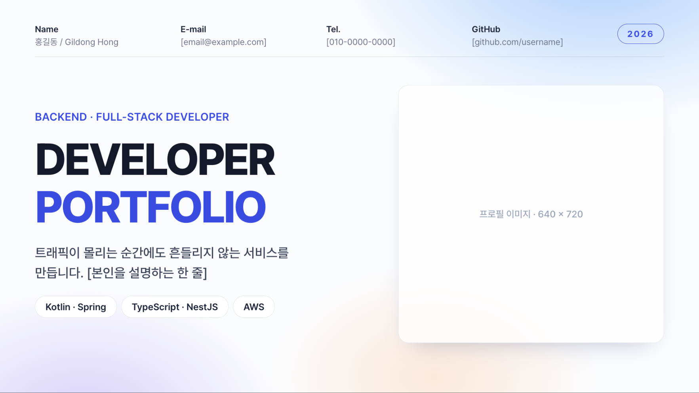
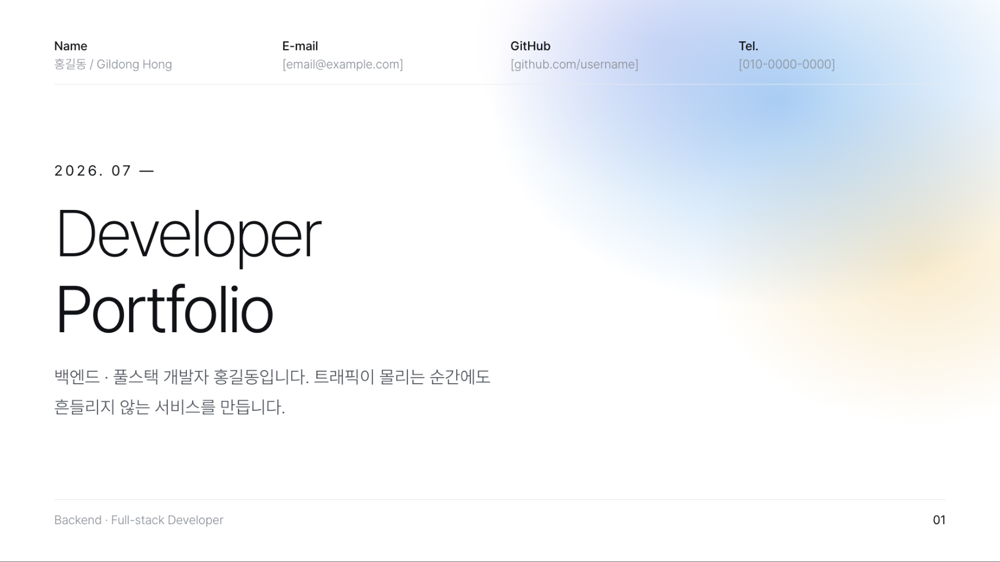
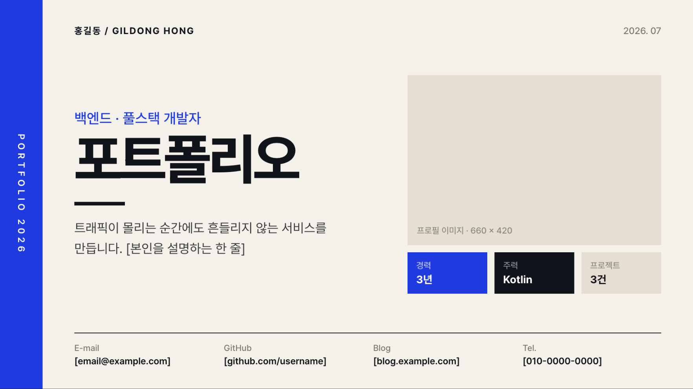
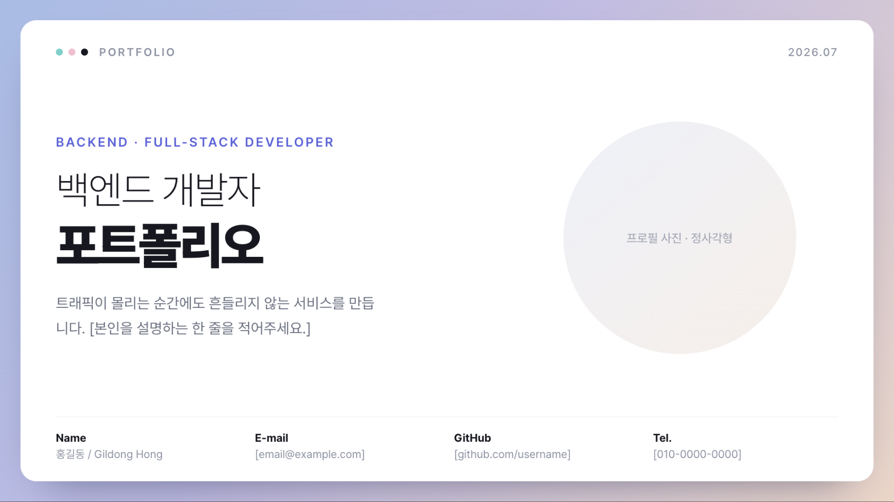
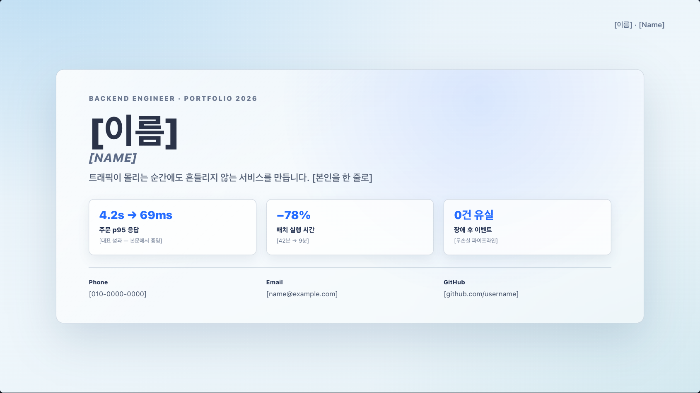

# Career-Skills

이력서 · 코딩테스트 · 면접 · 포트폴리오 — 채용 준비를 **AI 에이전트에게 맡기는** 실전 스킬 모음.

---

[시작하기](#시작하기) · [스킬 목록](#스킬-목록) · [디자인 갤러리](#디자인-갤러리)

---

## 시작하기

이 스킬들은 직접 명령어를 실행해서 쓰는 게 아니라 **AI 코딩 에이전트에게 맡겨** 씁니다.

사용하는 에이전트(Codex/OMX · Claude Code · Cursor 등)에게 이렇게 요청하세요:

> **"이 저장소 `skills/` 디렉토리에 있는 스킬들을 지금 프로젝트(또는 내 환경)에서 쓸 수 있게 세팅해줘."**

그러면 에이전트가 스킬을 알맞은 위치(`~/.codex/skills/`, `.claude/skills/` 등)에 설치합니다. 이후 `$스킬이름`(Codex/OMX) / `/스킬이름`(Claude Code)으로 부르거나, 관련된 요청("내 이력서 리뷰해줘", "이력서로 포폴 만들어줘")을 하면 해당 스킬이 자동으로 활용됩니다.

---

## 스킬 목록

### 📄 이력서

| 스킬 | 명령어 | 설명 |
|------|--------|------|
| 이력서 리뷰 | `$hiring-sim-resume-review` | ATS 시뮬레이션 + 리크루터 스크리닝 |
| 이력서 레드팀 | `$hiring-sim-resume-redteam` | 면접관 관점 감점 적발 — 수치 현실성(규모 추정·리서치) + GitHub 코드·블로그 직접 대조 |
| 서류 피드백 | `$hiring-prep-doc-feedback` | 이력서 / 자소서 / 포폴 리서치 기반 피드백 |
| 자기소개서 작성 | `$writing-prep-cover-letter` | 공고 + 이력서 기반 자소서 작성 (전략 진단 · STAR+KKK) |
| Kevin 피드백 | `$kevin-feedback` | Kevin 페르소나 말투의 이력서 피드백 |

### 💻 코딩테스트

| 스킬 | 명령어 | 설명 |
|------|--------|------|
| 코딩테스트 준비 | `$hiring-prep-coding-test` | 회사별 코테 리서치(플랫폼·라이브 여부·난이도·빈출 유형) → 유형별 문제 링크 + 학습 플랜 준비 문서 |
| 코딩테스트 모의 | `$hiring-sim-coding-test` | 회사 스타일 문제 출제 + 제출 코드 채점(정확성·복잡도·코드 품질·견고성) |

### 🗣️ 면접

| 스킬 | 명령어 | 설명 |
|------|--------|------|
| 면접 준비 문서 | `$hiring-prep-interview` | 공고 분석 + 병렬 리서치 기반 맞춤형 예상 질문 생성 |
| 면접 시뮬레이션 | `$hiring-sim-interview` | 기술 / 인성 / 컬처핏 면접 모의 |

### 🎨 포트폴리오

| 스킬 | 명령어 | 설명 |
|------|--------|------|
| 포트폴리오 제작 | `$portfolio-build` | 디자인 레퍼런스를 골라 내 자료(이력서·PDF·이미지·GitHub)로 슬라이드 포폴 자동 제작 |
| 포트폴리오 리뷰 | `$hiring-sim-portfolio-review` | 프로젝트 품질·의사결정 평가 + 수치 정합 감사 |
| 포트폴리오 레드팀 | `$hiring-sim-portfolio-redteam` | 면접관 관점의 감점 포인트 적발 (수치 모순·과장) |

> **통합** — `$hiring-sim-pipeline` : 이력서 → 코딩테스트 → 면접 전체 프로세스를 회사별로 자동 구성하고 REJECT 시 즉시 중단.

---

## 디자인 갤러리

`$portfolio-build`가 포함한 **디자인 레퍼런스**. 슬라이드는 고정 구성이 아니라 디자인 템플릿처럼 **복제·삭제·재배치**해 쓰며, AI가 자료·직무를 보고 자동으로 고르거나 직접 지정할 수 있습니다. (각 파일: `skills/portfolio-build/references/<이름>.html`)

<table>
<tr>
<td width="50%" valign="top"> <b>soft-aurora-indigo</b> 밝은 파스텔 오로라 · 인디고 — 산뜻·범용 (기본값)</td>
<td width="50%" valign="top"> <b>clean-white-azure</b> 순백 에디토리얼 · 애저 — 정갈·미니멀</td>
</tr>
<tr>
<td width="50%" valign="top"> <b>warm-ivory-cobalt</b> 따뜻한 아이보리 페이퍼 · 코발트 — 차분·고급</td>
<td width="50%" valign="top"> <b>gradient-wash-violet</b> 몽환적 그라데이션 워시 · 바이올렛 — 감각·크리에이티브</td>
</tr>
<tr>
<td width="50%" valign="top"> <b>frosted-glass-teal</b> 서늘한 프로스티드 글라스 · 틸/블루 — 대시보드·표 많은 백엔드</td>
<td width="50%"></td>
</tr>
</table>

---

## License

MIT — see [LICENSE](LICENSE)
